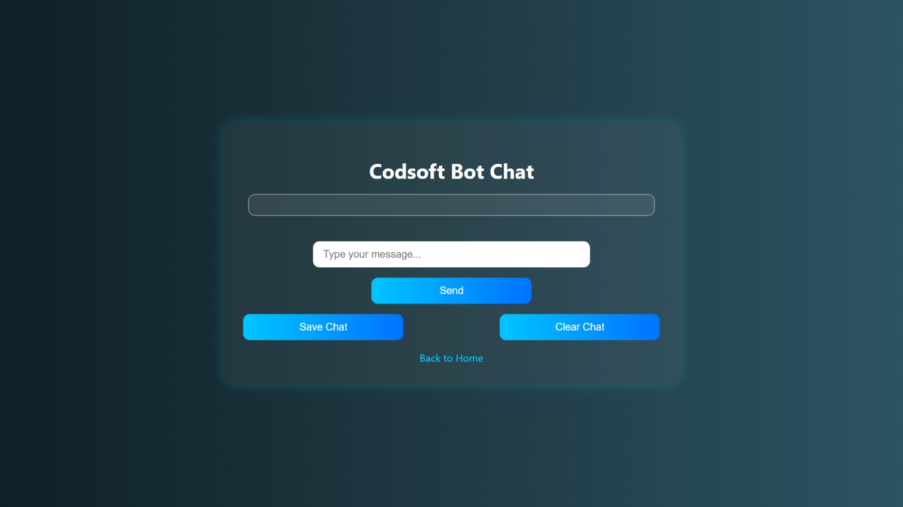
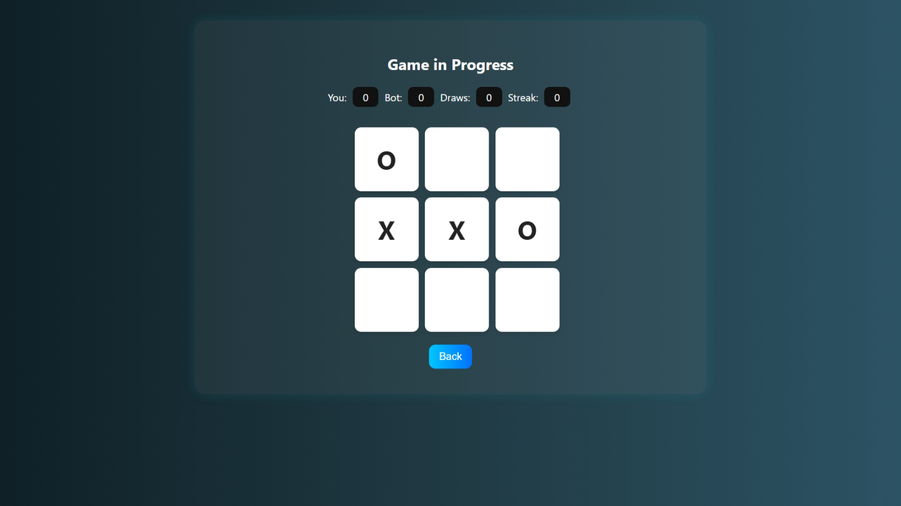
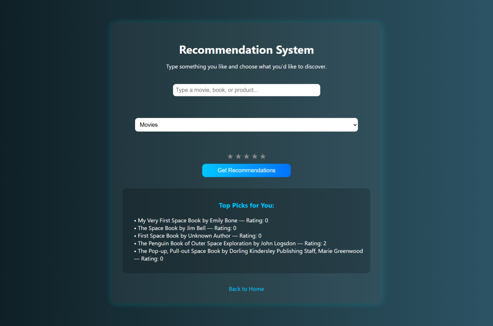

# Codsoft Bot

Codsoft Bot is an AI-powered multi-functional assistant built using Flask. It includes several AI tools designed for educational, entertainment, and productivity purposes. It was developed as part of the Codsoft AI internship project.

## 🚀 Features

* ✅ **Rule-Based Chatbot** – A simple chatbot using pre-defined rules.
* 🎮 **Tic Tac Toe AI** – A game with Easy, Medium, and Hard AI.
* 🖼️ **Image Captioning** – Upload an image to generate styled captions.
* 📚 **Recommendation System** – Suggests movies, books, and products using live APIs.
* 🧠 **Face Detection & Recognition** – Uses ArcFace for real-time face analysis.

## 💻 Tech Stack

* **Frontend:** HTML, CSS, JavaScript
* **Backend:** Python (Flask)
* **Libraries:**

  * `opencv-python`, `face_recognition`, `onnxruntime`
  * `requests`, `dotenv`, `numpy`
  * `Flask`, `werkzeug`, etc.

## 🧠 AI Integrations

* ArcFace ONNX model for face recognition
* Google Books API for book recommendations
* TMDB API replaced with IMDb-like scraping for movie suggestions
* FakeStore API for product suggestions

## 📁 Project Structure

```
Codsoft_Bot/
├── static/
│   ├── style.css
│   └── script.js
├── templates/
│   ├── index.html
│   ├── chatbot.html
│   ├── tictactoe.html
│   ├── caption.html
│   ├── caption_result.html
│   ├── face.html
│   ├── recommend.html
├── arcface_recog.py
├── face_recog.py
├── recommender.py
├── app.py
├── requirements.txt
└── README.md
```

## 🔧 Installation & Run

```bash
# Clone the repository
git clone https://github.com/Kunal20060208/Codsoft_Bot.git
cd Codsoft_Bot

# Install dependencies
pip install -r requirements.txt

# Create .env file and add keys if needed
# Example:
# TMDB_API_KEY=your_key_here

# Run the Flask app
python app.py
```

App runs on: `http://127.0.0.1:5000`

## 📸 Screenshots







## 📜 License

MIT License. See `LICENSE` file.

## ✨ Credits

* Internship: **Codsoft AI Internship**
* Developer: **Kunal Arya**
* Mentor: [Codsoft Organization](https://www.codsoft.in)

---

Made with 💙 by Kunal Arya
